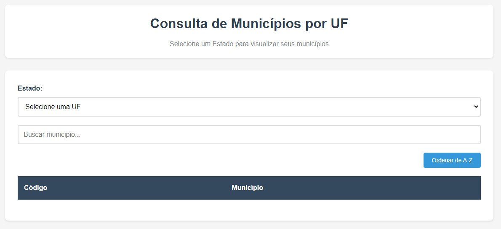

# Desafio 2 - Consulta de Municipios IBGE



Este projeto exibe uma lista de municípios de acordo com o estado selecionado pelo usuário. Os dados são obtidos a partir da API do IBGE.

## Como usar

### Opção 1: Abrir diretamente

1. Navegue até a pasta do projeto
2. De um duplo clique no arquivo index.html
3. O navegador padrão será aberto automaticamente

### Opção 2: Usando o terminal

1. Abra o terminal na pasta do projeto
2. Execute o comando:
   ```
   start index.html
   ```
3. O navegador padrão será aberto com a aplicação

### Opção 3: Usando o VS Code

1. Instale a extensão Live Server no VS Code
2. Clique com o botão direito no arquivo index.html
3. Selecione "Open with Live Server"

### Usando a aplicacao

1. Selecione um estado no menu suspenso
2. Aguarde o carregamento dos municípios
3. Use o campo de busca para filtrar municípios específicos
4. Clique em "Ordenar" para alternar entre A-Z ou Z-A
5. Use os botões de paginação se necessário

## Demonstração


## Funcionalidades

- Lista de todos os estados do Brasil
- Exibição de municipios por estado
- Campo de busca para filtrar municipios
- Ordenacao alfabética (A-Z e Z-A)
- Contador de municípios encontrados
- Paginção automática
- Indicador de carregamento
- Mensagens de erro em caso de falha

## Sobre o codigo IBGE

O código exibido na primeira coluna da tabela e o código oficial do IBGE para cada município. Este código tem 7 dígitos e serve como identificador único:

- Os 2 primeiros dígitos representam o Estado
- Os 5 últimos dígitos identificam o município

Exemplo: 3304557 = Rio de Janeiro/RJ

Este código é utilizado em sistemas governamentais e nunca muda, mesmo que o nome do município seja alterado.

## Estrutura do projeto

- index.html - Estrutura da pagina
- style.css - Estilos e layout
- script.js - Logica e consumo da API
- assets - Imagens e recursos

## Tecnologias

- HTML5
- CSS3
- JavaScript
- API do IBGE

## API utilizada

https://servicodados.ibge.gov.br/api/v1/localidades

## Observações

O projeto foi desenvolvido usando apenas HTML, CSS e JavaScript puro, sem frameworks externos.
